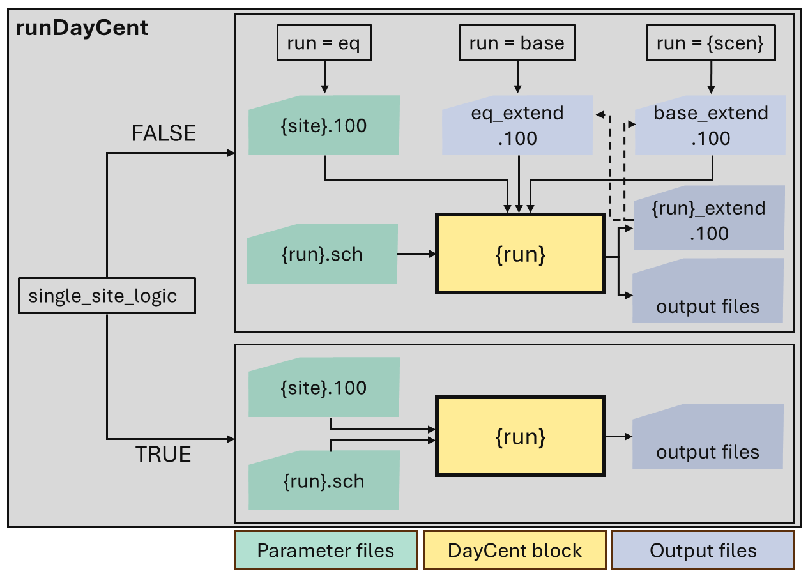
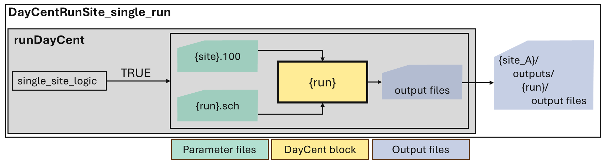
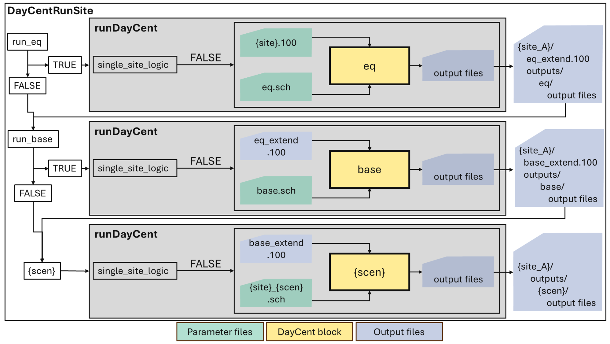

<!-- README.md is generated from README.Rmd. Please edit that file -->

# DDcentutils

<!-- badges: start -->

[](https://lifecycle.r-lib.org/articles/stages.html#experimental)

<!-- badges: end -->

DDcentutils is a package created by the Ecosystem Modeling and Data
Consortium (EMDC) Team at Colorado State University (CSU) to facilitate
the use of the DayCent® model and the visualization of DayCent model run
results.

We created a Discussions forum on GitHub to facilitate Q&A about the
package and suggest ideas for further development:
<https://github.com/CSU-Soil-Carbon-Solution-Center/DDcentutils/discussions>.

You can also report bugs by creating an issue on the repository. For
more about creating an issue, please visit:
<https://docs.github.com/en/issues/tracking-your-work-with-issues/using-issues/creating-an-issue>.

Please note that the package does not include access to the DayCent
model and its associated library files. DayCent is a CSU licensed
trademark and subject to the terms of use of the license agreement.
Users affiliated with a research or non-profit institution can request
free access to the model under a non-exclusive, non-commercial license
on <https://www.soilcarbonsolutionscenter.com/daycent>. Requests are
evaluated on a case-by-case basis and require acknowledging the
license’s terms of use and sharing basic information about the research
project.

Research or non-profit institution can also gain access for all
employees at their institution by becoming a member of the EMDC for free
<https://www.soilcarbonsolutionscenter.com/consortium.>.

Commercial entities can gain access to the DayCent model under a
non-exclusive commercial license. For more information about commercial
membership, please visit
<https://www.soilcarbonsolutionscenter.com/consortium.>.

## Installation

You can install the development version of DDcentutils from
[GitHub](https://github.com/) with:

``` r
# install.packages("pak")
pak::pak("CSU-Soil-Carbon-Solution-Center/DDcentutils")
```

## Directory structure

This package enforces a directory structure to establish robust file
organization practices. The DayCent environment consists of executables
and input and output files. Inputs include the .100, .in, and .sch
files. To better describe how this package deals with inputs and
outputs, we segment the files into library, parameter, data, and output
file categories, as depicted in the figure below.

<figure>


<figcaption>

Figure 1. The DayCent environment.
</figcaption>

</figure>

The proposed categories can be described as:

- Executables: include the DayCent model and the List100 program to
  extract outputs from the binary files.
- Library files: include the library of parameters for events specified
  in the schedule file and are shared across all sites.
- Parameter files: describe user-defined site-specific parameters (obs:
  .dat and C14DATA are optional files for a DayCent run).
- Data files: describe user-defined soils and weather data for the site.
- Output files: outputs from a DayCent run.

Good file organization helps avoid duplicate files and prevents
accidental overwriting by keeping outputs clearly named and separated.
The current directory structure in this package is defined as:

<pre>        
{project}/                                      ## user defined name for the project
├── executables/                                ## stores the executables
├── 100libraryfiles/                            ## stores the library files
└── sites/
    └── {site_A}/                               ## user defined name for the site; stores parameter and data files
        ├── {site}.100                          ## user defined name for the site.100 file
        ├── {site}_{run}.sch                    ## user defined name for the site and DayCent run in the schedule file name
        ├── {site}.wth                          ## user defined name for the site weather file
        └── outputs/                            ## stores output files; outputs are organized in separate folders per run
            └── eq
            └── base
            └── {scen}                          ## can be more than one folder per scenario run
                └── {site}_{scen}_harvest.csv   ## output name defined based on site schedule file name
</pre>

The names of the project and site folders are user defined. More than
one site folder within *sites/* is supported. The input files must
follow the pattern identified in the directory tree above, with name
convention for sites and scenarios defined by the user. Outputs are
organized per DayCent block run (equilibrium, baseline, scenario) within
the *outputs/* folder. More than one scenario folder within *outputs/*
is supported.

Let’s use a teaching example for one of the most famous long-term Soil
Organic Carbon (SOC) research sites, located in Wooster, Ohio, to
understand how the directory structure works. Since 1962, this site has
hosted comparison trials of no-till and conventional tillage for corn
and soybeans
(<https://soilfertility.osu.edu/research/long-term-tillage-plots>). In
this example, this is how the directory tree and file names could look
like:

<pre>            
{project}/
├── executables/
├── 100libraryfiles/
└── sites/
    └── <strong>Wooster</strong>/
        ├── <strong>wooster_site</strong>.100
        ├── <strong>wooster</strong>_<strong>cc_nt</strong>.sch
        ├── <strong>wooster</strong>_<strong>cc_ct</strong>.sch
        ├──  <strong>wooster</strong>.wth
        └── outputs/
            └── eq
            └── base
                └── <strong>base</strong>_harvest.csv
            └── <strong>cc_nt</strong>
                └── <strong>wooster</strong>_<strong>cc_nt</strong>_harvest.csv
            └── <strong>cc_ct</strong>
                └── <strong>wooster</strong>_<strong>cc_ct</strong>_harvest.csv
</pre>   

## How to use this package

This package is being developed to facilitate the use of the DayCent
model in three main aspects:

1.  Input file building and management
2.  Running DayCent
3.  Output visualization

### 1. Input file building and management

#### Setting up a new site

Asuming we are taking a global calibration approach to the fix.100
parameters and reusing crop and event .100 parameters, there are three
primary tasks when building a new site:

1)  Updating the site.100 file to represent the new location.

- This includes updating the latitude, longitude, cloud percentages, and
  monthly weather statistics.

2)  Define the soil layer parameters.

- For the equilibrium run, the package uses soil.in and site.par files
  to pass the parameterization.

3)  Build a weather file in the correct format from either station data
    or a gridded reanalysis product.

For any DayCent simulation, it is strongly recommended to start from an
existing site file set as a template and working on one file at a time.

#### Defining basic {site}.100 parameters

We need to change a series of parameters is the site.100, sitepar.in and
soils.in files.

In the {site}.100 file:

1)  First we can use the internal calculation of the program to find the
    weather statistics by changing “\*\*\* Climate parameters” line to
    “\*\*\* Climate statistics {site}.wth”.

    - This will use the weather file to recalculate the statistics
      rather than recalculating and replacing. These statistics are
      saved if an extended site.100 file is written.

2)  We need to change the latitude (SITLAT) and longitude (SITLNG)
    parameters.

    - The SITELNG parameter is not really used in the calculation, but
      the SITLAT (+/- 90 degrees) is critically important for estimating
      day length and and solar radiation if not provided in the weather
      file.

For this, we use the following function:

- **update_daycent_site_file**: Reads the file and replaces specific
  parameter values. The function description includes the supported
  parameter groups for update. The updated file is written to a new
  location.

#### Updating site parameters in the sitepar.in file

We also need to update some additional some parameters stored in the
sitepar.in file. Estimations of soil radiation and potential
evapotranspiration depend on the latitude but also the elevation and
cloud impacts on solar radiation. Several other parameters could be
changed (aspect, slope, etc…). These often have a small sensitivity to
SOC change, but novel sites may require careful evaluation of
controlling mechanisms. We can always change the site par.in file
manually or we can pull these data from other data sets and update them
directly.

This function uses R packages that pull data for sites from existing
APIs:

- **adjust_sitepar_srad_elev**: Retrieves and updates the solar
  radiation adjustment for cloud cover and transmission coefficient
  using the NASA POWER global data, and retrieves and updates the
  elevation, slope, and aspect using Mapzen terrain tiles.

#### Build Soil and Weather Data

With {site}.100 and sitepar files updated, we need to build the soil and
weather files for the site. As each simulation represents a point in
space, this point can be abstracted to a whole ecosystem or can
represent on soil core. It is easiest to treat each simulation as an
exact point.

We can provide direct observational data for soil and weather at that
point or, as more commonly done for large simulations, we can use
continuous modeled data from soil surveys, like SSURGO in the USA, or
gridded reanalysis weather products, such as Daymet or NASA POWER.

We have written functions to retrieve soils and weather data from
commonly used sources, such as SSURGO and Daymet, and have successfully
collaborated with community members to develop other functions for the
same purposes.

This package offers two options to update the *.wth* file and the output
for both will include the weather variables necessary for a DayCent run:
day of the month, month, maximum and minimum temperature (in degrees
Celsius), daily precipitation (cm), and shortwave radiation (W/m2).

- **getDaymetData**: retrieves the Daymet weather data of a specific
  site in **North America** based on its latitude and longitude using
  the *daymetr* package, including additional rows for day 366 in leap
  years.

- **getNASAPowerData**: retrieves the NASA POWER global weather data of
  a specific site based on its latitude and longitude using the
  *nasapower* package.

There are also two options to update the *soils.in* file and the output
for both is interpolated to fit the soil depth intervals for DayCent
when necessary.

- **convert_ssurgo_to_daycent**: converts SSURGO data into a
  DayCent-ready file format for specific locations. Data availability is
  restricted to the United States.

- **convert_soilgrids_to_daycent**: converts SoilGrids data into a
  DayCent-ready file format for specific locations. SoilGrids provides
  global data.

We welcome contributions of additional functions from other data
products and cross-valuation of data products!

#### Updating an existing schedule file

This package includes a simple function, **update_sch**, that reads an
existing DayCent schedule file (*{site}\_{run}.sch*) and replaces one or
more parameters (e.g., “Site file name”, “Starting year”) with new
values. This function will not write repeating parameters like schedule
events. It writes the modified file to a new output path.

### 2. Running DayCent

Running the DayCent model requires all the input files identified in
Figure 1. To facilitate running the model, there are three functions in
this package:

- **run_DayCent**: builds a command line execution and runs the DayCent
  model.

<figure>



<figcaption>

Figure 2. Schematic of the runDayCent function.
</figcaption>

</figure>

This function runs **one block** at a time, depicted by the gray boxes
in Fig. 2, and uses the {site}.100 directly. There is an argument
(single_site_logic) that allows bypassing the spin-up and using an
existing *{site}\_extend.100* file instead. The *run* argument defines
the DayCent block. The scenario run name is user defined and must match
the schedule file name.

- **DayCentRunSite_single_run**: a wrapper function on runDayCent to
  perform a DayCent run for a single site, one scenario at a time.

<figure>



<figcaption>

Figure 3. Schematic of the DayCentRunSite_single_run function.
</figcaption>

</figure>

Similar to **runDayCent**, this function runs **one block** at a time,
depicted by the gray boxes in Fig. 3. This function uses the {site}.100
file and any outputs exported, as indicated in the *output_scen*
argument, are saved in folders for each block within the
*{site}/outputs* folder. The scenario run name is also user defined and
must match the schedule file name.

- **DayCentRunSite**: a wrapper function on runDayCent to to perform one
  or more DayCent run blocks (equilibrium, base, and scenario).

<figure>



<figcaption>

Figure 4. Schematic of the DayCentRunSite function.
</figcaption>

</figure>

This function **can run all three blocks** if the *run_eq* and
*run_base* arguments are TRUE. Running the equilibrium and baseline
blocks is not required as long as an extended .100 file exists for the
block you are trying to bypass.

### 3. Output visualization

In this package, we offer three functions to facilitate output
visualization:

- plot_carbon_pools()
- plot_DayCent_water()
- plot_lis_standard()

#### plot_carbon_pools()

This function reads a data frame loaded from the dc_sip file and
produces seven narrative plots of the carbon pools over a specific
user-defined period time for a given scenario:

- Plot 1: plant carbon stocks
- Plot 2: litter carbon stocks
- Plot 3: soil organic carbon stocks
- Plot 4: rapid turnover of soil carbon stocks
- Plot 5: total system carbon stocks
- Plot 6: total soil carbon above and belowground
- Plot 7: relative turnover of soil carbon stocks

This function requires the input data from the dc_sip file in a
data.frame format. To create the plots, the data frame must have the
following columns from the dc_sip output:

- aglivc: Above ground live carbon for crop/grass
- bglivcj: Juvenile fine root live carbon for crop/grass
- bglivcm: Mature fine root live carbon for crop/grass
- crootc: Coarse root live carbon for forest
- fbrchc: Fine branch live carbon for forest
- frootcj: Juvenile fine root live carbon for forest
- frootcm: Mature fine root live carbon for forest
- metabc(1): Carbon in metabolic component of surface litter
- metabc(2): Carbon in metabolic component of soil litter
- rleavc: Leaf live carbon for forest
- rlwodc: Large wood live carbon for forest
- som1c(1): Carbon in surface active soil organic matter
- som1c(2): Carbon in soil active soil organic matter
- som2c(1):Carbon in surface slow soil organic matter
- som2c(2): – Carbon in soil slow soil organic matter
- som3c: Carbon in passive soil organic matter
- stdedc: Standing dead carbon
- strucc(1): Carbon in structural component of surface litter
- strucc(2): Carbon in structural component of soil litter
- wood1c: Dead fine branch carbon
- wood2c: Dead large wood carbon

#### plot_DayCent_water()

This package provides functions for visualizing daily water balance
data, including inflows, outflows, and storage components, using stacked
and faceted plots.

Required inputs are the following specific outfiles from DayCent, which
should be found in the *{scen}* folder within the *{site}* folder:

- watrbal.out: daily water balance
- vswc.out: daily volumetric soil water content by layer
- wfps.out: daily water filled pore space by layer

This function also requires the *soils.in* file as an input.

This function builds five different plots of water balance components
from DayCent outputs:

- Plot 1: Stacked inflows
- Plot 2: Stacked outflows
- Plot 3: Soil and snow storage
- Plot 4: Faceted inflow-storage-outflow
- Plot 5: Combined inflow and outflow

#### plot_lis_standard()

This function generates standard plots for SOC stock, aboveground
biomass and harvested grain carbon from the *.lis* output.

The required input is built using build_list_from_bin(). Use this
function to create a data frame from the *.lis* file. The data frame
must include the “somsc” and “cgrain” columns. The *abg_col* argument
allows the user to select the aboveground column to be plotted and must
match a column name in the data frame. The chosen variable must be
included in the variables list when using the *build_list_from_bin()*
function. If no aboveground biomass column is identified, the function
defaults to “agcprd”, which must be included in the data frame.

This function builds three different plots:

- Plot 1: SOC stocks
- Plot 2: Aboveground biomass C
- Plot 3: Harvested grain C
